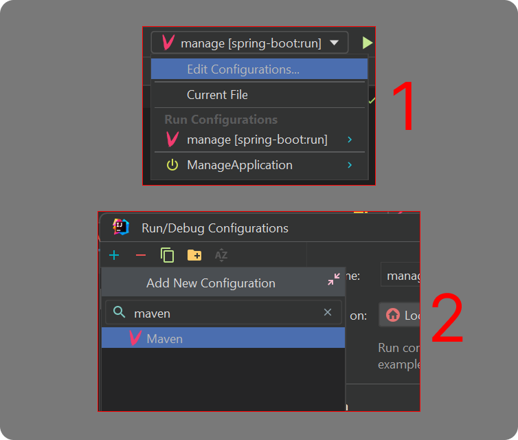
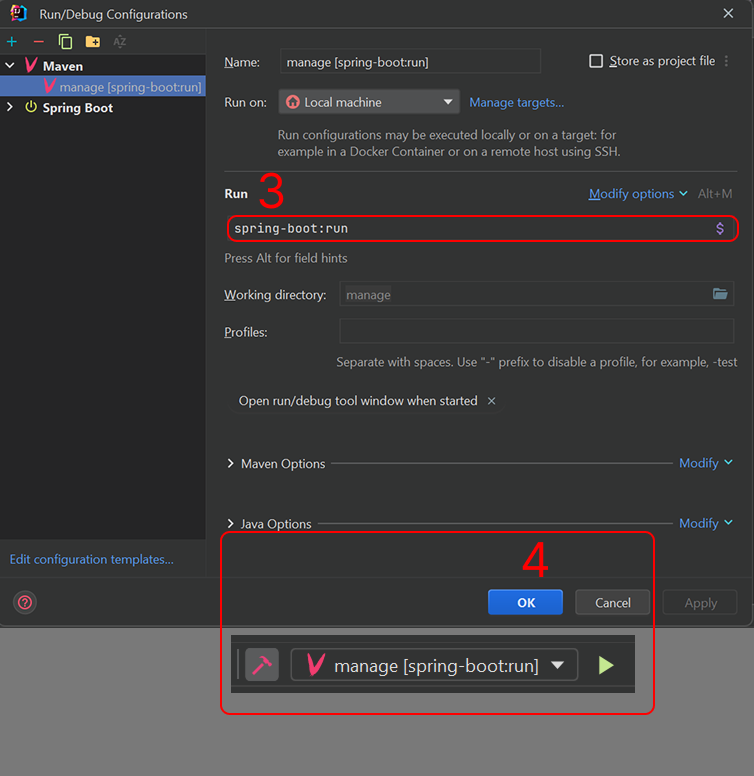
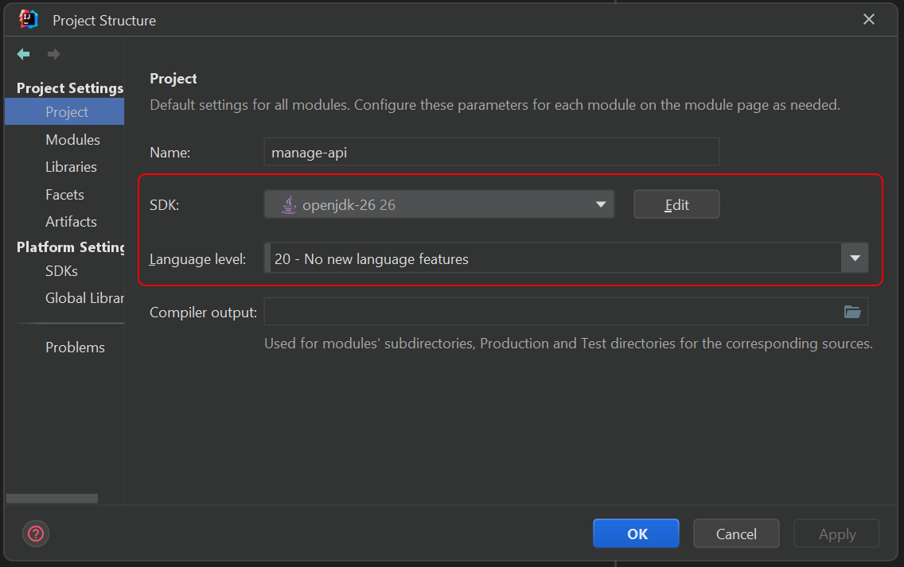

# 🚀 Task Management System (Back End - Java Spring boot)

โปรเจกต์นี้ถูกออกแบบมาเพื่อรันในสภาพแวดล้อมจำลองแบบ Localhost เท่านั้น เพื่อใช้ในการพัฒนาและทดสอบระบบภายในเครื่อง

## Prerequisites & Setup (สิ่งที่ต้องเตรียมและตั้งค่า)

ใช้ IntelliJ IDEA สำหรับการ start api

1. มองไปที่มุมขวาบนของโปรแกรม คลิกที่ปุ่ม Add Configuration... (หรือชื่อโปรเจกต์เดิมที่มีอยู่แล้วเลือก Edit Configurations...)
2. คลิกเครื่องหมาย [+] ที่มุมซ้ายบน แล้วเลือก Maven
3. ในช่อง Command line: ให้พิมพ์: spring-boot:run
4. กด OK แล้วกดปุ่ม Run (สามเหลี่ยมสีเขียว) ได้เลย

เพิ่มเติม Setup Project Structure

- SDK: OpenJDK 26 (Latest JDK)
- Language Level: 20 - No new language features

หรือทำตามภาพ (คลิกเพื่อเปิดดูขั้นตอน)

<details>
  <summary>📸 คลิกเพื่อดูรูปภาพขั้นตอนการ Setup Configuration</summary>
  
  <br>
  
  ### Step 1: Add Configuration
  
  
  ### Step 2: Select Maven
  
  
  ### Step 3: Command spring-boot:run
  
  
</details>

## Technical Specification

- Spring Boot: 4.0.5
- Java: 26
- Language Level: 20 (Stable Features)
- Maven: 3.9.x
- Springdoc-OpenAPI: 3.0.2

## 📖 API Documentation (Swagger UI)

สามารถทดสอบและดูรายละเอียด endpoint ทั้งหมดของระบบผ่าน Swagger UI ได้เมื่อรัน Backend สำเร็จ

```
Url: http://localhost:8080/api/docs
```

## 📌 Important Notes

- **Port:** ค่าเริ่มต้นคือ `8080` (หากมีการเปลี่ยนแปลงให้ตรวจสอบที่ Console ตอน Start)
- **Localhost Only:** ระบบถูกตั้งค่ามาเพื่อรันแบบ Localhost เท่านั้น

---

**Developed by Nattawat Thanwiset (Ohm)**
